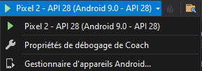

[Retour](cr-coach.md)

# Configuration de l'appareil permettant de tester l'application.

Ici étant pour une application mobile, on vas directement prendre l'exemple d'un mobile et non pas dans émulateur android.

Tout d'abord, il suffit juste d'activer le debogage de son appareil afin d'avoir accés à un menu de fonctionnalités cachées qui permet de tester des applications.

*Paramètres>A propos>Build Number x7*

Enfin après branchement USB entre l'appareil et l'ordinateur, un onglet est maintenant disponbile dans *Paramètres>Options Dév* où il suffit de cocher le USB Debugging si ce n'est pas fait.

Puis pour terminer, la connexion de l'appareil sur l'ordinateur il faut lier les deux via:

Et selectionner le bon appareil.
