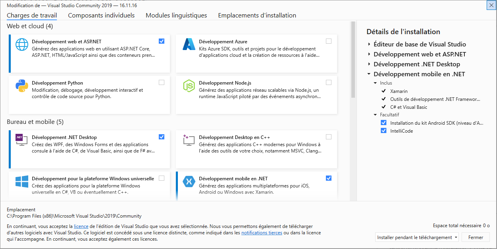

[Retour](cr-coach.md)

# Installation et configuration de xamarin dans l'éditeur.
Dans l'editeur de code, par exemple en fonction de nos précedent projets, la fonctionnalité est déja é-preinstallé si cela n'est pas le cas alors celle-ci est facilement disponible dans *outils>obtenir les fonctionnalités*.

>Ici "Developpement mobile en .Net" est à cocher puis a installer.

Pour verifier si la modification à bien effectuer,on devrais avoir accés à un onglet "Xamarin" dans *Aide* ou bien dans *Aide>A propos de Microsoft Visual Studio* où le produit Xamarin est visible.

>Si pas présent, on reitere la l'ajout de la fonctionnalité.

Malgrés l'intégration de Xamarin dans l'éditeur de code, celui ci ne permet l'affichage sur mobile ou sur l'appareil relatif à l'affichage.

Xamarin.Android utilise un JDK(Java Runtime Environment) pour l'implémentation de la machine virtuelle Java qui exécute des programmes Java et Android SDK(Software development kit) qui regroupe un ensemble d'outils d'aide à la programmation d'applications mobiles Android.

On y a accés au JDK et Android SDK dans *Outils>Options>Xamarin>Paramètres Android*.

Grace à l'intégration de SDK Android, "Android SDK Command Line Tools" est disponible via *Outils>Android>Gestionnaire SDK Android*. 

