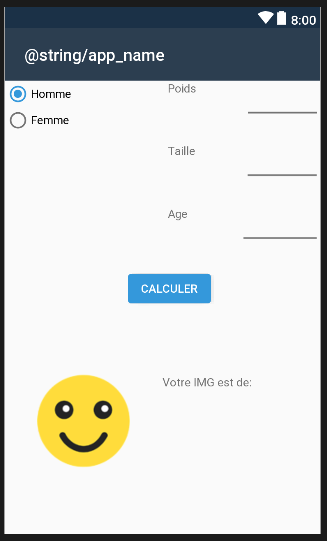
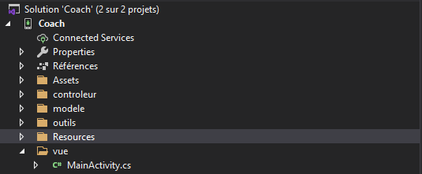

[Retour](cr-coach.md)

# Mission 1:
Cette mission à pour but de créer la toute première version de l'application qui est de renvoyer un résultat ainsi qu'un message.

On commence par créer un nouveau project en Application Android Xamarin. Celle-ci sera initialiser vide.

Le fichier "MainActivity.cs" est le fichier principal de notre application.
La classe "MainActivite" qui permet de créer une action activite.

Sachant que chaque utilisateur correspond à une activité.

Une méthode est déja intégrer afin de definir le layout gràce à l'interface utilisateur en XML.
La méthode "OnCreate":
```C#
using Android.App;
using Android.OS;
using Android.Runtime;
using AndroidX.AppCompat.App;
using Android.Widget;
using Coach.controleur;
using System;
using Coach.modele;

namespace Coach
{
    [Activity(Label = "@string/app_name", Theme = "@style/AppTheme", MainLauncher = true)]
    public class MainActivity : AppCompatActivity
    {
        protected override void OnCreate(Bundle savedInstanceState)
        {
            base.OnCreate(savedInstanceState);
            Xamarin.Essentials.Platform.Init(this, savedInstanceState);
            // Set our view from the "main" layout resource
            SetContentView(Resource.Layout.activity_main);
        }
    }
}
```

Le layout exprimer précédement se trouve dans l'explorateur de solutions *Ressources>Layout*, ici se trouve l'interface utilisateur.

## Interface graphique
L'interface graphique avec le code de "activity_main.xml":
```XML
<?xml version="1.0" encoding="utf-8"?>
<RelativeLayout
    android:orientation="vertical"
    xmlns:android="http://schemas.android.com/apk/res/android"
    xmlns:app="http://schemas.android.com/apk/res-auto"
    xmlns:tools="http://schemas.android.com/tools"
    android:minWidth="25px"
    android:minHeight="25px"
    android:layout_width="match_parent"
    android:layout_height="match_parent"
    android:id="@+id/relativeLayout1">
    <LinearLayout
        android:orientation="vertical"
        android:minWidth="25px"
        android:minHeight="25px"
        android:layout_width="match_parent"
        android:layout_height="match_parent"
        android:id="@+id/linearLayout1" >
        <LinearLayout
            android:orientation="horizontal"
            android:minWidth="25px"
            android:minHeight="25px"
            android:layout_width="match_parent"
            android:layout_height="wrap_content"
            android:layout_weight="1"
            android:id="@+id/linearLayout2" >
            <LinearLayout
                android:orientation="vertical"
                android:minWidth="25px"
                android:minHeight="25px"
                android:layout_width="wrap_content"
                android:layout_weight="1"
                android:layout_height="match_parent"
                android:id="@+id/linearLayout5" >
                <RadioGroup
                    android:minWidth="25px"
                    android:minHeight="25px"
                    android:layout_width="match_parent"
                    android:layout_height="wrap_content"
                    android:id="@+id/radioGroup1">
                    <RadioButton
                        android:layout_width="wrap_content"
                        android:layout_height="wrap_content"
                        android:checked="true"
                        android:text="Homme"
                        android:id="@+id/rdHomme" />
                    <RadioButton
                        android:layout_width="wrap_content"
                        android:layout_height="wrap_content"
                        android:text="Femme"
                        android:id="@+id/rdFemme" />
                    
                </RadioGroup>
            </LinearLayout>
            <LinearLayout
                android:orientation="vertical"
                android:minWidth="25px"
                android:minHeight="25px"
                android:layout_width="wrap_content"
                android:layout_weight="1"
                android:layout_height="match_parent"
                android:id="@+id/linearLayout6" >
                <LinearLayout
                    android:orientation="horizontal"
                    android:minWidth="25px"
                    android:minHeight="25px"
                    android:layout_width="match_parent"
                    android:layout_height="wrap_content"
                    android:layout_weight="1"
                    android:id="@+id/linearLayout9" >
                    <LinearLayout
                        android:orientation="vertical"
                        android:minWidth="25px"
                        android:minHeight="25px"
                        android:layout_width="wrap_content"
                        android:layout_height="match_parent"
                        android:layout_weight="1"
                        android:id="@+id/linearLayout13" >
                        <TextView
                            android:text="Poids"
                            android:layout_width="match_parent"
                            android:layout_height="wrap_content"
                            android:id="@+id/textView2" />
                    </LinearLayout>
                    <LinearLayout
                        android:orientation="vertical"
                        android:minWidth="25px"
                        android:minHeight="25px"
                        android:layout_width="wrap_content"
                        android:layout_height="match_parent"
                        android:layout_weight="1"
                        android:id="@+id/linearLayout12" >
                        <EditText
                            android:layout_width="match_parent"
                            android:layout_height="wrap_content"
                            android:id="@+id/txtPoids" />
                    </LinearLayout>
                </LinearLayout>
                <LinearLayout
                    android:orientation="horizontal"
                    android:minWidth="25px"
                    android:minHeight="25px"
                    android:layout_width="match_parent"
                    android:layout_height="wrap_content"
                    android:layout_weight="1"
                    android:id="@+id/linearLayout10" >
                    <LinearLayout
                        android:orientation="vertical"
                        android:minWidth="25px"
                        android:minHeight="25px"
                        android:layout_width="wrap_content"
                        android:layout_height="match_parent"
                        android:layout_weight="1"
                        android:id="@+id/linearLayout15" >
                        <TextView
                            android:text="Taille"
                            android:layout_width="match_parent"
                            android:layout_height="wrap_content"
                            android:id="@+id/textView3" />
                    </LinearLayout>
                    <LinearLayout
                        android:orientation="vertical"
                        android:minWidth="25px"
                        android:minHeight="25px"
                        android:layout_width="wrap_content"
                        android:layout_height="match_parent"
                        android:layout_weight="1"
                        android:id="@+id/linearLayout14" >
                        <EditText
                            android:layout_width="match_parent"
                            android:layout_height="wrap_content"
                            android:id="@+id/txtTaille" />
                    </LinearLayout>
                </LinearLayout>
                <LinearLayout
                    android:orientation="horizontal"
                    android:minWidth="25px"
                    android:minHeight="25px"
                    android:layout_width="match_parent"
                    android:layout_height="wrap_content"
                    android:layout_weight="1"
                    android:id="@+id/linearLayout11" >
                    <LinearLayout
                        android:orientation="vertical"
                        android:minWidth="25px"
                        android:minHeight="25px"
                        android:layout_width="wrap_content"
                        android:layout_height="match_parent"
                        android:layout_weight="1"
                        android:id="@+id/linearLayout17" >
                        <TextView
                            android:text="Age"
                            android:layout_width="match_parent"
                            android:layout_height="wrap_content"
                            android:id="@+id/textView4" />
                    </LinearLayout>
                    <LinearLayout
                        android:orientation="vertical"
                        android:minWidth="25px"
                        android:minHeight="25px"
                        android:layout_width="wrap_content"
                        android:layout_height="match_parent"
                        android:layout_weight="1"
                        android:id="@+id/linearLayout16" >
                        <EditText
                            android:layout_width="match_parent"
                            android:layout_height="wrap_content"
                            android:id="@+id/txtAge" />
                    </LinearLayout>
                </LinearLayout>
            </LinearLayout>
        </LinearLayout>
        <LinearLayout
            android:orientation="horizontal"
            android:minWidth="25px"
            android:minHeight="25px"
            android:layout_width="match_parent"
            android:layout_height="wrap_content"
            android:layout_weight="1"
            android:id="@+id/linearLayout3">
            <Button
                android:text="Calculer"
                android:layout_width="wrap_content"
                android:layout_height="wrap_content"
                android:id="@+id/btCalculer"
                android:layout_marginRight="0"
                android:layout_gravity="center_horizontal"
                android:layout_marginLeft="150" />
        </LinearLayout>
        <LinearLayout
            android:orientation="horizontal"
            android:minWidth="25px"
            android:minHeight="25px"
            android:layout_width="match_parent"
            android:layout_height="wrap_content"
            android:layout_weight="1"
            android:id="@+id/linearLayout4" >
            <LinearLayout
                android:orientation="vertical"
                android:minWidth="25px"
                android:minHeight="25px"
                android:layout_width="wrap_content"
                android:layout_height="match_parent"
                android:layout_weight="1"
                android:id="@+id/linearLayout7" >
                <ImageView
                    android:src="@drawable/smiley_ok"
                    android:layout_width="match_parent"
                    android:layout_height="wrap_content"
                    android:id="@+id/imgSmiley" />
            </LinearLayout>
            <LinearLayout
                android:orientation="vertical"
                android:minWidth="25px"
                android:minHeight="25px"
                android:layout_width="wrap_content"
                android:layout_height="match_parent"
                android:layout_weight="1"
                android:id="@+id/linearLayout8" >
                <TextView
                    android:text="Votre IMG est de: "
                    android:layout_width="match_parent"
                    android:layout_height="wrap_content"
                    android:id="@+id/textIMG" />
                <TextView
                    android:text=""
                    android:layout_width="match_parent"
                    android:layout_height="wrap_content"
                    android:id="@+id/lbIMG" />
            </LinearLayout>
        </LinearLayout>
    </LinearLayout>
</RelativeLayout>
```
Renvoie comme visuel ceci:




## Modèle MVC
Tout d'abord en utilisant le modèle MVC(Modèle View Controler),l'objectif global de celui-ci est de séparer les aspects traitement, données et présentation, et de définir les interactions entre ces trois aspects. 
Pour simplifier, les données sont gérées par le modèle, la présentation par la vue, les traitements par des actions et l'ensemble est coordonné par les contrôleurs.

Après application du modele MVC, l'arbre de solution ressemble à ceci:



### Création du modele.
La classe "Profil.cs" est créer dans ce modèle afin de mémoriser les données nécessaires pour les prochains calculs.

```C#
using System;

namespace Coach.modele
{
    public class Profil
    {
        private int sexe;
        private int poids;
        private int taille;
        private int age;
        private double img;
        private string message;

        public Profil(int sexe, int poids, int taille, int age)
        {
            this.sexe = sexe;
            this.poids = poids;
            this.taille = taille;
            this.age = age;
            CalculImg();
            ResultatImg();
        }
        public int GetSexe() { return sexe; }

        public int GetPoids() { return poids; }

        public int GetTaille() { return taille; }

        public int GetAge() { return age; }

        public double GetImg() { return img; }

        public string GetMessage() { return message; }
    }
}
```

Dans cette classe on retrouve deux méthodes:
- Le constructeur: il permet de construire un objet d'une classe.
- Les getters: il permet de récuper une donnée normalement privée.

Ensuite on crée une fonction CalculImg qui retourne l'indice de masse grasse de la personne.

```C#
        public void CalculImg()
        {
            double imc = poids / Math.Pow((double)taille / 100, 2);
                    
            img = (1.2 * imc) + (0.23 * Convert.ToDouble(age)) - (10.83 * Convert.ToDouble(sexe)) - 5.4;
        }
```

Puis grace à se calcule on peut retrouner un message en fonction du résultat.

```C#
        public bool isMan => sexe == 1 ? true : false;
        public bool isSkinyMale => (img < (img * 10 / 100)) ? true : false;
        public bool isSkinyFemale => (img < (img * 15 / 100)) ? true : false;
        public bool isMediumMale => ((img * 0 / 100) < img || img > (img * 25 / 100)) ? true : false;
        public bool isMediumFemale => ((img * 15 / 100) < img || img > (img * 30 / 100)) ? true : false;


        public void ResultatImg()
        {
            string messgage = isMan ? (isSkinyMale ? "Trop maigre" : isMediumMale ? "Parfait" : "Surpoids") : (isSkinyFemale ? "Trop maigre" : isMediumFemale ? "Parfait" : "Surpoids");
        }

```

## Tests unitaires
Les tests unitaires permettent de tester le bon fonctionnement d'une partie précise du programme. 
Ici pour les entrées utilisateurs. 

### Méthode de calcul de l'img
```C#
        [TestMethod]
        public void TestMethodCalculImg()
        {

            Profil profil = new Profil(/*DateTime.Now, */1, 80, 180, 20);

            var resultatAttendu = 18.03;

            var resultatTest = profil.GetImg();

            Assert.AreEqual(resultatAttendu, resultatTest, delta: 0.1);
        }
```

### Méthode de résultat de l'img
```C#

        [TestMethod]
        public void TestMethodMessageImg()
        {

            Profil profil = new Profil(/*DateTime.Now, */1, 80, 180, 20);

            var resultatAttendu = "Parfait";

            var resultatTest = profil.GetMessage();

            Assert.AreEqual(resultatAttendu, resultatTest);
            
        }
```
### Création du controleur.
Ici place au controleur, la classe controle de celui-ci est une classe qui ne peut être héritée par aucune autre classe mais qui peut être instanciée. 
Comme ci-dessous:

```C#
sealed class Controle
    {
        
        private static Controle instance = null;
        private static Profil profil;
        private Controle(){}

        public static Controle GetInstance()
        {
            if (Controle.instance == null)
            {
                Controle.instance = new Controle();

            }
            return Controle.instance;
        }
    }
```

Afin de créer un profil grace au modele, on utilie une méthode public qui crée un profil via les informations distribués dans la vue.
Où l'on peut aussi retourner l'img et le message.

```C#
public void CreerProfil(int unPoids, int uneTaille, int unAge, int unSexe)
        {
            profil = new Profil(unSexe, unPoids, uneTaille, unAge);
        }

        public double GetImg() => profil.GetImg();

        public string GetMessage() => profil.GetMessage();

```

### Création de la vue.
```C#
using Android.App;
using Android.OS;
using Android.Runtime;
using AndroidX.AppCompat.App;
using Android.Widget;
using Coach.controleur;
using System;
using Coach.modele;

namespace Coach
{
    [Activity(Label = "@string/app_name", Theme = "@style/AppTheme", MainLauncher = true)]
    public class MainActivity : AppCompatActivity
    {
        protected override void OnCreate(Bundle savedInstanceState)
        {
            base.OnCreate(savedInstanceState);
            Xamarin.Essentials.Platform.Init(this, savedInstanceState);
            // Set our view from the "main" layout resource
            SetContentView(Resource.Layout.activity_main);
            init();
        }
        public override void OnRequestPermissionsResult(int requestCode, string[] permissions, [GeneratedEnum] Android.Content.PM.Permission[] grantResults)
        {
            Xamarin.Essentials.Platform.OnRequestPermissionsResult(requestCode, permissions, grantResults);

            base.OnRequestPermissionsResult(requestCode, permissions, grantResults);
        }

        private EditText txtPoids;
        private EditText txtTaille;
        private EditText txtAge;
        private RadioButton rdHomme;
        private RadioButton rdFemme;
        private TextView lbIMG;
        private ImageView imgSmiley;
        private Button btCalculer;

        private Controle controle;

        public void init()
        {
            this.controle = Controle.GetInstance(this);

            txtPoids = (EditText)FindViewById(Resource.Id.txtPoids);
            txtTaille = (EditText)FindViewById(Resource.Id.txtTaille);
            txtAge = (EditText)FindViewById(Resource.Id.txtAge);
            rdHomme = (RadioButton)FindViewById(Resource.Id.rdHomme);
            rdFemme = (RadioButton)FindViewById(Resource.Id.rdFemme);
            lbIMG = (TextView)FindViewById(Resource.Id.lbIMG);
            imgSmiley = (ImageView)FindViewById(Resource.Id.imgSmiley);

            btCalculer = (Button)FindViewById(Resource.Id.btCalculer);
            btCalculer.Click += btCalculer_Click;
        }

        private void btCalculer_Click(object sender, EventArgs e)
        {
            int poids = 0;
            int taille = 0;
            int age = 0;
            int sexe = 0;
            try
            {
                poids = int.Parse(txtPoids.Text);
                taille = int.Parse(txtTaille.Text);
                age = int.Parse(txtAge.Text);
            }
            catch (Exception ex)
            {
                Toast.MakeText(this, "Saisie incorrect", ToastLength.Long).Show();
            }

            if (rdHomme.Checked)
            {
                sexe = 1;
            }

            if (poids == 0 || taille == 0 || age == 0)
            {
                Toast.MakeText(this, "Merci de remplir tous les champs", ToastLength.Long).Show();
            }
            else
            {
                AfficherResultat(poids, taille, age, sexe);
            }
        }
    }
}
```

Dans ce bout de code on fait:
- Initialise les propriétès
- On crée au instance du controle
- On lie les propriétés avec leur objets graphiques
- Ajour d'une méthode local "init()" qui va créer une instance de la classe controle.
- Gestion des événements "btCalculer_Click()" qui transmet à "Afficher résultat" qui va être afficher sur l'interface de l'utilisateur.

```C#
private void AfficherResultat(int unPoids, int uneTaille, int unAge, int unSexe)
        {
            this.controle.CreerProfil(unPoids, uneTaille, unAge, unSexe);
            double img = this.controle.GetImg();
            string message = this.controle.GetMessage();
            if (message == "Parfait")
            {
                imgSmiley.SetImageResource(Resource.Drawable.Smiley_Ok);
                lbIMG.SetTextColor(Android.Graphics.Color.DarkGreen);
            }
            else if (message == "Trop maigre")
            {
                imgSmiley.SetImageResource(Resource.Drawable.Smiley_PasTop);
                lbIMG.SetTextColor(Android.Graphics.Color.DarkRed);
            }
            else
            {
                imgSmiley.SetImageResource(Resource.Drawable.Smiley_No);
                lbIMG.SetTextColor(Android.Graphics.Color.DarkRed);
            }
            lbIMG.Text = string.Format("{0:0.00}", img) + "% " + message;
        }
```
